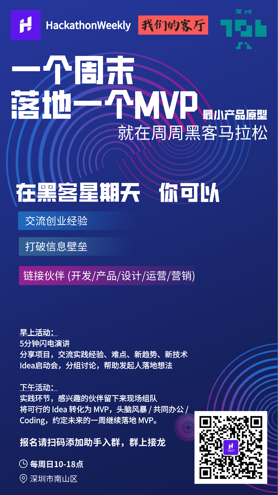

# 线下活动

> [!WARNING]
> 目前只有深圳有线下活动，其他城市的欢迎自发组织活动，我们会提供活动宣传支持。

## 黑客星期天

## 🚀【HackathonWeekly 黑客星期天】🚀
🌟 想在周末闲暇之余，与极客们来一场思维火花的碰撞吗？在黑客星期天，你可以交流创业经验，打破信息壁垒，链接伙伴（开发/产品/设计/运营/营销），一个周末落地一个MVP。

## 🎉 活动内容：
早上  idea头脑风暴
5分钟闪电演讲：鼓励分享项目中遇到的难点，实践经验，新趋势新技术。（自由报名，每期演讲嘉宾5人，分享内容不限）
分组讨论：30s自我介绍，快速认识新伙伴；随后由嘉宾组织分组讨论，每个人都能分享自己的观点，学习新知识。
Idea 启动会：自由报名，Idea 发起人花 3 分钟介绍自己的想法，听众根据自己的专业知识给予反馈，帮助 idea 发起人实现想法，感兴趣者可以现场组队
下午  idea实现
主要为实践环节，感兴趣的伙伴可以留下来继续头脑风暴 / 实践 idea / 共同办公

## 🎯活动理念
1. 降低 MVP 的落地成本，帮助参与者将脑袋中的 Idea 变成实际行动，带上你的电脑和 idea 来现场吧！
2. 留更多时间互动，鼓励交流真实项目落地的各种难点和实际思考点，而不是泛泛而谈。
3. 高效信息交流，丰富创业宝藏（方法论/共创伙伴/创业经验），得益于活动基于协作文档，我们鼓励参与者事先将自我介绍，项目介绍，打算讨论的 Idea 全部写到协作文档中，避免重复介绍

## ❤ 时间表：
- 9:30-10:00 签到，自由交流
- 10:00-10:30 5分钟闪电演讲，参与者30秒自我介绍
- 10:30-11:00 分组讨论，认识朋友，分享资源
- 11:00-11:30 Idea 启动会，每人3分钟介绍自己的新 idea
- 11:30-12:00 再次分组讨论：帮助彼此完善 idea
- 12:00-18:00 延续上午活动，感兴趣的伙伴可以留下来，继续完善 Idea / Coding / 共同办公，现场磨合建立信任，约定未来的一周继续落地 MVP。

## 📝报名方式
扫码添加小助手入群，群上接龙。座位有限，速来占位！

接龙：格式为姓名 + 职业 + 参加上午 or 下午 or 全天活动 + 打算在现场分享的内容（每期名额5人） + 打算讨论的新想法 （没有的话写无）
示例1：Jack，全栈，全天，分享：编程新手如何快速做出一个MVP，讨论Idea：AI日程管理工具
示例2：Amy，产品，上午，无，无